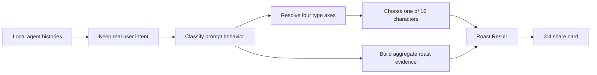

<a id="readme-top"></a>

<div align="center">
  

  <h1>Vibe Roaster</h1>

  <p>
    Turn your local AI coding history into a 16-type personality profile—and let it roast the evidence.
  </p>

  <p>
    <a href="https://www.npmjs.com/package/vibe-roast">
      
    </a>
    <a href="https://www.npmjs.com/package/vibe-roast">
      
    </a>
    
    
    <a href="#privacy">
      
    </a>
  </p>

  <p>
    <a href="#quick-start"><strong>Quick start</strong></a>
    ·
    <a href="#what-you-get">What you get</a>
    ·
    <a href="#how-the-profile-works">How it works</a>
    ·
    <a href="#privacy">Privacy</a>
    ·
    <a href="#development">Development</a>
    ·
    <a href="README.zh-CN.md">中文</a>
  </p>
</div>

---

Vibe Roaster reads local coding-agent histories and builds:

- a four-letter coding type;
- one of 16 illustrated characters;
- an evidence-grounded roast;
- recurring project and domain themes;
- Agent, provider, model, token, and activity analytics;
- a 3:4 share card.

The personality calculation is deterministic and local. AI writing is optional.

<p align="center">
  <a href="./media/promo/masters/screencast.mp4">
    
  </a>
</p>

<p align="center">
  <sub>Watch the 30-second demo · click for the 1080p version</sub>
</p>

<p align="center">
  
</p>

## Quick start

### Run from npm

Requires Node.js 20 or newer.

```bash
npx vibe-roast
```

Vibe Roaster scans the supported local stores it can find, starts the local dashboard server, and opens:

```text
http://localhost:7681
```

`tokentracker-cli` ships as a runtime dependency. The first launch initializes its
local-only collectors and compatible hooks; later launches sync the queue before
opening the report. Activity is always measured in Tokens. If TokenTracker cannot
collect data for a source, the UI shows zero for that source.

Vibe Roaster invokes TokenTracker in local-only, no-auth mode. TokenTracker's
account, OAuth, leaderboard, and cloud sync features are not used.

Interactive terminals show a short branded launch animation. Piped output, CI,
and `NO_COLOR` environments use plain text.

Missing agents are skipped. You don't need to configure every source, create an
account, or provide an API key to see the local result.

The download badge reports npm Registry fetches per month. `npx vibe-roast` counts
when npm needs to download the package; cached runs may not.

### Choose how the roast is written

On first launch, choose one of three paths:

| Mode | What happens | Account or key |
| --- | --- | --- |
| Local roast | Uses deterministic bilingual copy | None |
| Hosted roast | GitHub identifies the profile; Cloudflare Workers AI writes and caches the roast | GitHub sign-in |
| Your provider | Sends aggregate roast evidence to your selected model | DeepSeek, OpenAI, Anthropic, Gemini, Groq, or OpenRouter key |

GitHub login is for identity only. It does not use GitHub Models.

## What you get

<table>
  <tr>
    <td width="50%">
      <strong>16 coding personalities</strong><br />
      Four inspectable behavior axes resolve into one illustrated character—Builder, Debugger, Prompt Priest, Agent Commander, and twelve more.
    </td>
    <td width="50%">
      <strong>Evidence-grounded roast</strong><br />
      The type stays deterministic. Optional AI writing turns aggregate signals and contradictions into bilingual comedy without receiving the exact requests you typed.
    </td>
  </tr>
  <tr>
    <td width="50%">
      <strong>Usage analytics</strong><br />
      Explore activity heatmaps, trends, Agent share, provider/model usage, and available Codex or Claude context breakdowns.
    </td>
    <td width="50%">
      <strong>Recurring themes</strong><br />
      A time- and Agent-filtered cloud promotes repeated coding concepts, project nouns, frameworks, subsystems, and meaningful acronyms.
    </td>
  </tr>
  <tr>
    <td width="50%">
      <strong>Semantic Hashtags</strong><br />
      AI reads coherent concept clusters and turns them into shareable character labels instead of copying the highest-frequency token.
    </td>
    <td width="50%">
      <strong>Shareable by design</strong><br />
      Export a 1080 × 1440 personality card with the character, roast, axes, complete Hashtag set, repository URL, and one-command install path.
    </td>
  </tr>
</table>

<p align="center">
  
  
  
  
</p>

## How the profile works



### The four axes

This is MBTI-like presentation for observed coding-agent behavior—not psychology, ability, or code quality.

| Axis | Left | Right | Main evidence |
| --- | --- | --- | --- |
| M / A | **Maker** · asks for runnable artifacts | **Architect** · asks for plans and explanations | implementation and repair vs planning and research |
| O / P | **Orchestrator** · delegates through workflows | **Promptsmith** · directs one agent precisely | workflow language vs direct prompt craft |
| V / S | **Verifier** · proves and repairs | **Shipper** · builds and releases | debugging, testing, refactor vs implementation and packaging |
| F / X | **Focused** · keeps requests compact | **Max-context** · supplies broad context | useful/reference balance and long-prompt ratio |

Every axis exposes its evidence split. The winning letters are concatenated—`MPSF`, for example—and mapped to a character.

### The 16 types

| Type | Character | Type | Character |
| --- | --- | --- | --- |
| MOVF | Agent Engineer | AOVF | Systems Architect |
| MOVX | Systems Wrangler | AOVX | Context Cartographer |
| MOSF | YOLO Shipper | AOSF | Strategy Shipper |
| MOSX | Agent Commander | AOSX | Agent Believer |
| MPVF | Debugger | APVF | Architect |
| MPVX | Context Maxxer | APVX | Prompt Priest |
| MPSF | Builder | APSF | Diagram Sprinter |
| MPSX | Tab Hoarder | APSX | Infinite Planner |

There is no primary/secondary persona and no quality rank. Fewer than 20 useful prompts produces a provisional type; confidence grows with sample size and clearer axis separation.

<details>
<summary><strong>Prompt categories and weighting</strong></summary>

Classification is multi-label. A request such as “fix this login bug and add a regression test” contributes half to Debugging and half to Testing, so one verbose prompt cannot count several times.

| Category | Typical evidence |
| --- | --- |
| Planning | plans, architecture, brainstorming |
| Debugging | failures, exceptions, root-cause work |
| Testing | tests, regression, assertions, coverage |
| Refactor | restructuring, extraction, cleanup |
| Packaging | build, release, publish, deployment |
| Explanation | explain, why, walkthrough |
| Research | search, documentation, investigation |
| UI design | pages, components, layout, CSS/UX |
| Workflow | agents, hooks, MCP, skills, automation |
| Implementation | useful requests without a more specific category |
| Reference | pasted code, logs, stack traces, system/tool noise |

Reference material is excluded from useful-intent counts.

</details>

<details>
<summary><strong>Word cloud and domain discovery</strong></summary>

The word cloud is not a raw token dump. It removes pasted code, paths, markup fragments, provider boilerplate, conversational filler, and stop words. English identifiers are split into readable terms; Chinese text uses `Intl.Segmenter` plus a compact developer vocabulary.

Ranking favors the number of distinct prompts containing a concept, with a smaller logarithmic repetition bonus. Common bilingual variants are merged, lexical/category duplicates are collapsed, and recurring acronyms preserve their observed casing.

Project-domain entities do not need to be hardcoded. A candidate can be promoted when it:

- recurs across independent prompts;
- behaves like a project noun;
- concentrates within a project period;
- carries a distinctive acronym or entity signal.

The same Day / Week / Month / Total / Custom and Agent filters apply to the cloud, token totals, usage trend, and model breakdown.

</details>

### AI roast and bilingual Hashtags

Only a compact `roast_evidence` object is ever sent over the network. It contains
aggregate type, axis, category, dimension, concept, and activity signals—never
the text you typed into an Agent.

The writer cannot change the deterministic type. In one model call it produces:

- three-beat English and Chinese roasts;
- bilingual TL;DR punchlines;
- five paired Hashtags with `en`, `zh`, semantic `kind`, and a short shared `meaning`.

Hashtags are semantic interpretations, not frequency labels. Chinese is localized
from the intended joke rather than translated literally. Proper names, framework
names, and meaningful acronyms may stay unchanged.

## Privacy

Vibe Roaster is local-first. The AI roast and hosted profile cache are optional network features.

| Data | Local profile | Optional AI roast | Hosted profile cache |
| --- | --- | --- | --- |
| Prompt text you typed | Used locally | Never sent | Never stored |
| Local paths and configuration | Local only | Never sent | Never stored |
| Aggregate categories and scores | Computed locally | Sent when explicitly enabled | Stored as a compact snapshot |
| Generated roast and Hashtags | Local result | Returned by selected model | Stored for stable signed-in profiles |
| API key | Not required | Used for that request only | Never stored by the local app |

The UI runs on localhost. The Node server is not hardened for public exposure—don't
expose port `7681` to untrusted networks.

GitHub sessions are stored under `~/.vibe-roast/` with owner-only permissions. A
cached roast is reused until the profile changes materially.

## Supported sources

Vibe Roaster inspects the sources it can find and treats missing roots as empty.

| Source | ID | Default store |
| --- | --- | --- |
| Codex | `codex` | `~/.codex/sessions` |
| Claude Code | `claude` | `~/.claude/projects` |
| Cursor | `cursor` | platform `state.vscdb` |
| Cline | `cline` | VS Code/Cursor global storage |
| Roo Code | `roo` | VS Code/Cursor global storage |
| Continue | `continue` | `~/.continue/sessions` |
| Gemini CLI | `gemini` | `~/.gemini/tmp/*/chats` |
| Aider | `aider` | `.aider.chat.history.md` |
| Windsurf | `windsurf` | `~/.codeium/windsurf` plaintext exports |
| Copilot Chat | `copilot` | VS Code/Cursor global storage |
| Amazon Q | `amazonq` | `~/.aws/amazonq/history` |
| Antigravity | `antigravity` | `~/.gemini/antigravity(-ide)/conversations` |
| OpenCode | `opencode` | `~/.local/share/opencode/opencode.db` |
| TokenTracker (bundled) | activity only | `~/.tokentracker/tracker/queue.jsonl` |
| Vibe tracker | `vibe-tracker` | `~/.vibe-roast/sessions.jsonl` |

Cursor and OpenCode are best-effort and require the local `sqlite3` command. Encrypted or binary histories are skipped.

<details>
<summary><strong>Known source limitations</strong></summary>

- Windsurf Cascade and Antigravity protobuf trajectories are not parsed without a plaintext export.
- ChatGPT desktop history is encrypted.
- Cursor cloud-only threads may not have readable local bubbles.
- TokenTracker covers supported local histories and keeps the Activity unit in Tokens. Platform permissions and upstream log formats can still leave an individual source at zero.
- Agent context categories are aggregate estimates. Codex tool attribution is turn-based; Claude content-block attribution is approximate.

</details>

## CLI

### Inspect without the UI

```bash
npx vibe-roast inspect \
  --from 2026-06-01 \
  --to 2026-06-08 \
  --sources codex,claude,cursor
```

The JSON report includes source summaries, activity, word frequencies, prompt analysis, the four-axis profile, aggregate roast evidence, and normalized prompt records.

### Override local stores

```bash
npx vibe-roast inspect \
  --codex-root /path/to/codex/sessions \
  --claude-root /path/to/claude/projects \
  --cursor-db /path/to/state.vscdb
```

Additional overrides:

```text
--home
--cline-root
--roo-root
--continue-root
--gemini-root
--aider-root
--windsurf-root
--copilot-root
--amazonq-root
--antigravity-root
--opencode-root
--token-tracker-queue
```

### Token collection diagnostics

```bash
npx tokentracker-cli status
npx tokentracker-cli doctor
```

Installing the npm package does not modify Agent configuration. The first
`vibe-roast` run initializes TokenTracker; TokenTracker manages its own hooks and
local queue from that point on.

## Configuration

Most users need no environment variables.

| Variable | Purpose |
| --- | --- |
| `PORT` | Change the local server port from `7681` |
| `VIBE_ROAST_NO_OPEN=1` | Start without opening the browser |
| `VIBE_ROAST_PLAIN_OUTPUT=1` | Disable terminal color and launch animation |
| `VIBE_ROAST_AUTH_BROKER_URL` | Override the hosted OAuth/AI broker for development or self-hosting |
| `DEEPSEEK_BASE_URL` | Override the default DeepSeek-compatible endpoint |
| `DEEPSEEK_MODEL` | Override the default DeepSeek model |

For local development, place ignored values in `.env.local`. Explicit shell environment variables take precedence.

Never commit API keys, client secrets, session secrets, `.env.local`, or `worker/.dev.vars`.

## Development

### Install and build

```bash
git clone https://github.com/PinkR1ver/vibe-roast.git
cd vibe-roast
npm install
npm run build
npm run serve
```

### Vite development mode

```bash
# terminal 1: API and local assets
VIBE_ROAST_NO_OPEN=1 npm run serve

# terminal 2: Vite HMR
npm run dev
```

Vite runs at `http://localhost:5173` and proxies `/api` plus `/assests` to the local Node server.

### Tests

```bash
npm test
npm run build
```

Tests cover adapters, fixture parsing, prompt hygiene, activity aggregation, type scoring, word-cloud entities, AI schema validation, OAuth/broker behavior, caching, Hashtags, and frontend helpers.

### Project map

```text
bin/                    CLI entrypoints
src/sources/            local Agent adapters
src/extract/            prompt and concept extraction
src/lib/                scoring, activity, roast, cache snapshots
dashboard/src/          React Roast Result UI
worker/                 Cloudflare OAuth + hosted AI broker
assests/                published visual pack (spelling is intentional)
test/                   Node fixtures and tests
.agents/                architecture, decisions, and feature specs
```

For architecture details, see [the project architecture](https://github.com/PinkR1ver/vibe-roast/blob/main/.agents/docs/architecture.md). For the hosted OAuth and free-AI flow, see [the hosted-roast architecture](https://github.com/PinkR1ver/vibe-roast/blob/main/.agents/docs/hosted-roast-architecture.md).

## Self-hosting the broker

The public npm package defaults to `https://auth.pinktalk.online`. End users do not need a GitHub Client Secret.

The included Cloudflare Worker uses:

- GitHub OAuth with state and PKCE;
- one-time broker tickets;
- a SQLite Durable Object for sessions, quota, and cached profiles;
- a fixed Workers AI model;
- a nine-call UTC-day limit per signed-in account.

Deployment and secret configuration live in [`worker/README.md`](worker/README.md).

## Current limitations

- Prompt classification is keyword-based.
- Scores reflect prompt behavior, not task difficulty or code quality.
- Long prompts are a proxy for context appetite.
- Activity totals do not influence the personality type.
- Domain discovery is heuristic and needs repeated mentions.
- The profile can change as new session evidence shifts meaningfully.

## Contributing

Issues and pull requests are welcome. Read [CONTRIBUTING.md](CONTRIBUTING.md)
for development setup, test requirements, privacy rules, AI-assisted
contribution disclosure, and the review process.

Report vulnerabilities privately according to [SECURITY.md](SECURITY.md).
Never commit private session dumps, user histories, tokens, or credentials.

<p align="right">(<a href="#readme-top">back to top</a>)</p>
