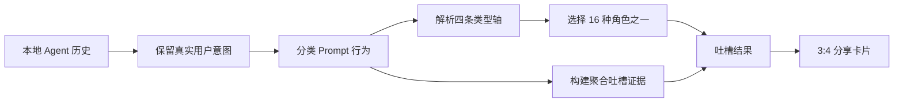

<a id="readme-top"></a>

<div align="center">
  

  <h1>Vibe Roaster</h1>

  <p>
    将你的本地 AI 编程历史转化为 16 型人格画像——让它用证据来"吐槽"你。
  </p>

  <p>
    <a href="https://www.npmjs.com/package/vibe-roast">
      
    </a>
    <a href="https://www.npmjs.com/package/vibe-roast">
      
    </a>
    
    
    <a href="#privacy">
      
    </a>
  </p>

  <p>
    <a href="#quick-start"><strong>快速开始</strong></a>
    ·
    <a href="#what-you-get">提供的功能</a>
    ·
    <a href="#how-the-profile-works">画像如何工作</a>
    ·
    <a href="#隐私">隐私</a>
    ·
    <a href="#开发">开发</a>
  </p>
</div>

---

Vibe Roaster 读取本地的 AI 编程对话记录，生成：

- 一个四字母的编程人格类型；
- 16 种插画角色之一；
- 一份基于证据的"吐槽"文案；
- 反复出现的项目和领域主题；
- Agent、模型提供商、模型、Token 与活跃度分析；
- 一张 3:4 分享卡片。

人格计算是确定性的且在本地完成。AI 写作是可选功能。

<p align="center">
  <a href="./media/promo/masters/screencast.mp4">
    
  </a>
</p>

<p align="center">
  <sub>观看 30 秒演示 · 点击查看 1080p 版本</sub>
</p>

<p align="center">
  
</p>

<h2 id="quick-start">快速开始</h2>

### 从 npm 运行

需要 Node.js 20 或更高版本。

```bash
npx vibe-roast
```

Vibe Roaster 会扫描它能找到的受支持本地存储，启动本地仪表盘服务器，并打开：

```text
http://localhost:7681
```

`tokentracker-cli` 作为运行时依赖一起发布。首次启动会初始化仅本地的收集器和兼容钩子；后续启动会先同步 TokenTracker 队列再打开报告。活跃度始终以 Token 计量。如果 TokenTracker 无法为某个数据源收集数据，UI 显示为零。

Vibe Roaster 以仅本地、无认证模式调用 TokenTracker。TokenTracker 的账户、OAuth、排行榜和云端同步功能不会被使用。

交互式终端会显示一段简短的品牌启动动画。管道输出、CI 以及 `NO_COLOR` 环境自动使用纯文本。

缺失的 Agent 会被跳过。无需配置所有数据源、创建账户或提供 API 密钥即可查看本地结果。

下载量徽章报告的是 npm Registry 每月包下载次数。`npx vibe-roast` 在 npm 需要下载时计入；已缓存时不计入。

### 选择吐槽文案的生成方式

首次启动时，可从以下三种方式中选择：

| 模式 | 说明 | 账户或密钥 |
| --- | --- | --- |
| 本地生成 | 使用确定性的双语文案 | 不需要 |
| 托管生成 | GitHub 标识个人资料；Cloudflare Workers AI 生成并缓存吐槽 | GitHub 登录 |
| 你选择的提供商 | 将聚合的吐槽证据发送给你选择的模型 | DeepSeek、OpenAI、Anthropic、Gemini、Groq 或 OpenRouter 密钥 |

GitHub 登录仅用于身份标识，不使用 GitHub Models。

<h2 id="what-you-get">提供的功能</h2>

<table>
  <tr>
    <td width="50%">
      <strong>16 种编程人格</strong><br />
      四条可检查的行为轴映出一种插画角色——Builder、Debugger、Prompt Priest、Agent Commander 等十二种。
    </td>
    <td width="50%">
      <strong>基于证据的吐槽</strong><br />
      人格类型固定不变。可选的 AI 写作基于聚合信号和矛盾生成双语吐槽，不会收到你输入的 Prompt 文本。
    </td>
  </tr>
  <tr>
    <td width="50%">
      <strong>使用分析</strong><br />
      活跃度热力图、趋势、Agent 份额、模型/提供商使用情况，以及 Codex 或 Claude 的上下文分解。
    </td>
    <td width="50%">
      <strong>反复出现的主题</strong><br />
      可按时间和 Agent 过滤的词云，展示编程概念、项目名词、框架、子系统和有含义的首字母缩写。
    </td>
  </tr>
  <tr>
    <td width="50%">
      <strong>语义化 Hashtag</strong><br />
      AI 读取连贯的概念聚类并生成可分享的角色标签，而非复制最高频的 Token。
    </td>
    <td width="50%">
      <strong>分享卡片</strong><br />
      导出 1080 × 1440 人格卡片，包含角色、吐槽、坐标轴、完整 Hashtag 集合、仓库地址和一行安装命令。
    </td>
  </tr>
</table>

<p align="center">
  
  
  
  
</p>

<h2 id="how-the-profile-works">画像如何工作</h2>



### 四条类型轴

这是对已观察到的编程 Agent 行为的 MBTI 式呈现——与心理学、能力或代码质量无关。

| 轴 | 左侧 | 右侧 | 主要证据 |
| --- | --- | --- | --- |
| M / A | **Maker（创造者）** · 要求可运行的产物 | **Architect（架构师）** · 要求方案和解释 | 实现与修复 vs 规划与研究 |
| O / P | **Orchestrator（调度者）** · 通过工作流委派 | **Promptsmith（提示词师）** · 精准引导单一 Agent | 工作流语言 vs 直接提示词技巧 |
| V / S | **Verifier（验证者）** · 验证和修复 | **Shipper（交付者）** · 构建和发布 | 调试、测试、重构 vs 实现和打包 |
| F / X | **Focused（聚焦型）** · 保持请求简洁 | **Max-context（最大上下文）** · 提供宽广的上下文 | 有用/参考内容比例和长提示词比率 |

每条轴都暴露其证据分布。获胜的字母组合起来——例如 `MPSF`——被映射到一个角色。

### 16 种类型

| 类型 | 角色 | 类型 | 角色 |
| --- | --- | --- | --- |
| MOVF | Agent Engineer | AOVF | Systems Architect |
| MOVX | Systems Wrangler | AOVX | Context Cartographer |
| MOSF | YOLO Shipper | AOSF | Strategy Shipper |
| MOSX | Agent Commander | AOSX | Agent Believer |
| MPVF | Debugger | APVF | Architect |
| MPVX | Context Maxxer | APVX | Prompt Priest |
| MPSF | Builder | APSF | Diagram Sprinter |
| MPSX | Tab Hoarder | APSX | Infinite Planner |

没有主要/次要之分，也没有质量排名。少于 20 条有用 Prompt 会产生临时类型；置信度随样本量增长而提高。

<details>
<summary><strong>Prompt 分类与权重</strong></summary>

分类是多标签的。类似"修复这个登录 bug 并添加回归测试"的请求，一半贡献给 Debugging，一半贡献给 Testing——一条长篇 Prompt 不会被重复计数多次。

| 分类 | 典型证据 |
| --- | --- |
| Planning（规划） | 方案、架构、头脑风暴 |
| Debugging（调试） | 失败、异常、根因排查 |
| Testing（测试） | 测试、回归、断言、覆盖率 |
| Refactor（重构） | 结构调整、抽取、清理 |
| Packaging（打包） | 构建、发布、部署 |
| Explanation（解释） | 解释含义、为什么、步骤说明 |
| Research（研究） | 搜索、文档、调研 |
| UI Design（界面设计） | 页面、组件、布局、CSS/UX |
| Workflow（工作流） | Agent、钩子、MCP、技能、自动化 |
| Implementation（实现） | 没有更具体分类的有用请求 |
| Reference（参考） | 粘贴的代码、日志、堆栈跟踪、系统/工具噪音 |

参考内容不计入有用意图计数。

</details>

<details>
<summary><strong>词云与领域发现</strong></summary>

词云去掉了粘贴的代码、路径、标记片段、模板提示词、对话填充词和停用词。英文标识符拆分为可读词语；中文文本使用 `Intl.Segmenter` 加精简的开发者词典。

排序优先考虑包含该概念的不同 Prompt 数量，重复出现给予较小的对数加成。常见中英双语变体会合并，词汇/分类重复项会折叠，经常出现的首字母缩写保留其观察到的形式。

项目领域实体无需硬编码。候选概念在以下情况下会被提升：
- 在多个独立 Prompt 中反复出现；
- 表现为一个项目名词；
- 在某个时间段内集中出现；
- 带有独特的首字母缩写或实体信号。

日 / 周 / 月 / 总计 / 自定义以及 Agent 过滤同时适用于词云、Token 总数、使用趋势和模型分解。

</details>

### AI 吐槽和双语 Hashtag

只有精简的 `roast_evidence` 对象会通过网络发送。它包含聚合的类型、轴、分类、维度、概念和活跃度信号——永远不会包含你输入给 Agent 的文本。

生成步骤不会改变固定的人格类型。一次模型调用产出：

- 三段式英中吐槽；
- 双语 TL;DR 金句；
- 五对 Hashtag，分别带有 `en`、`zh`、语义 `kind` 和共享的简短 `meaning`。

Hashtag 是语义解读，而非频率标签。中文是根据笑点意图本地化，而非逐字翻译。专有名词、框架名称和有含义的首字母缩写可能保持原样。

<h2 id="privacy">隐私</h2>

Vibe Roaster 是本地优先的。AI 吐槽和托管画像缓存是可选的网络功能。

| 数据 | 本地画像 | 可选 AI 吐槽 | 托管画像缓存 |
| --- | --- | --- | --- |
| 你输入的 Prompt 文本 | 本地使用 | 绝不发送 | 绝不存储 |
| 本地路径和配置 | 仅本地 | 绝不发送 | 绝不存储 |
| 聚合的分类和分数 | 本地计算 | 仅在显式启用时发送 | 存储为精简快照 |
| 生成的吐槽文案和 Hashtag | 本地结果 | 由所选模型返回 | 为稳定的登录画像存储 |
| API 密钥 | 不需要 | 仅用于该次请求 | 本地应用不存储 |

用户界面运行在 localhost。Node 服务器未加固以供公开暴露——请勿将 `7681` 端口暴露到不信任的网络。

GitHub 会话存储在 `~/.vibe-roast/` 下，仅所有者可读写。缓存的吐槽在画像发生实质性变化之前会复用。

## 受支持的数据源

Vibe Roaster 检查它能找到的数据源，并将缺失的根目录视为空。

| 数据源 | 标识符 | 默认存储位置 |
| --- | --- | --- |
| Codex | `codex` | `~/.codex/sessions` |
| Claude Code | `claude` | `~/.claude/projects` |
| Cursor | `cursor` | 平台 `state.vscdb` |
| Cline | `cline` | VS Code/Cursor globalStorage |
| Roo Code | `roo` | VS Code/Cursor globalStorage |
| Continue | `continue` | `~/.continue/sessions` |
| Gemini CLI | `gemini` | `~/.gemini/tmp/*/chats` |
| Aider | `aider` | `.aider.chat.history.md` |
| Windsurf | `windsurf` | `~/.codeium/windsurf` 纯文本导出 |
| Copilot Chat | `copilot` | VS Code/Cursor globalStorage |
| Amazon Q | `amazonq` | `~/.aws/amazonq/history` |
| Antigravity | `antigravity` | `~/.gemini/antigravity(-ide)/conversations` |
| OpenCode | `opencode` | `~/.local/share/opencode/opencode.db` |
| TokenTracker（内置） | 仅活跃度 | `~/.tokentracker/tracker/queue.jsonl` |
| Vibe tracker | `vibe-tracker` | `~/.vibe-roast/sessions.jsonl` |

Cursor 和 OpenCode 的解析依赖本地的 `sqlite3` 命令。加密或二进制的历史记录会被跳过。

<details>
<summary><strong>已知的数据源限制</strong></summary>

- Windsurf Cascade 和 Antigravity 的 protobuf 轨迹在无纯文本导出时无法解析。
- ChatGPT 桌面端历史记录是加密的。
- Cursor 纯云端线程可能没有可读的本地气泡。
- TokenTracker 覆盖受支持的本地历史记录，并将活跃度单位保持在 Token。平台权限和上游日志格式仍可能导致某个数据源为零。
- Agent 上下文分类是聚合估计值。Codex 工具归因是基于轮次的；Claude 内容块归因是近似值。

</details>

## CLI 命令

### 不启动 UI 进行检查

```bash
npx vibe-roast inspect \
  --from 2026-06-01 \
  --to 2026-06-08 \
  --sources codex,claude,cursor
```

JSON 报告包含数据源摘要、活跃度、词频、Prompt 分析、四轴画像、吐槽证据和归一化的 Prompt 记录。

### 覆盖本地存储位置

```bash
npx vibe-roast inspect \
  --codex-root /path/to/codex/sessions \
  --claude-root /path/to/claude/projects \
  --cursor-db /path/to/state.vscdb
```

额外的覆盖选项：

```text
--home
--cline-root
--roo-root
--continue-root
--gemini-root
--aider-root
--windsurf-root
--copilot-root
--amazonq-root
--antigravity-root
--opencode-root
--token-tracker-queue
```

### Token 收集诊断

```bash
npx tokentracker-cli status
npx tokentracker-cli doctor
```

安装 npm 包不会修改 Agent 配置。首次 `vibe-roast` 运行会初始化 TokenTracker；此后 TokenTracker 自行管理其钩子和本地队列。

## 环境变量

大多数用户无需设置环境变量。

| 变量 | 用途 |
| --- | --- |
| `PORT` | 将本地服务器端口从 `7681` 改为其他端口 |
| `VIBE_ROAST_NO_OPEN=1` | 启动时不打开浏览器 |
| `VIBE_ROAST_PLAIN_OUTPUT=1` | 禁用终端颜色和启动动画 |
| `VIBE_ROAST_AUTH_BROKER_URL` | 覆盖托管的 OAuth/AI 代理地址，用于开发或自部署 |
| `DEEPSEEK_BASE_URL` | 覆盖默认的 DeepSeek 兼容端点 |
| `DEEPSEEK_MODEL` | 覆盖默认的 DeepSeek 模型 |

如需本地开发，在 `.env.local` 中放入无需提交的值。命令行环境变量具有更高优先级。

绝不能提交 API 密钥、客户端密钥、会话密钥、`.env.local` 或 `worker/.dev.vars`。

<h2 id="开发">开发</h2>

### 安装与构建

```bash
git clone https://github.com/PinkR1ver/vibe-roast.git
cd vibe-roast
npm install
npm run build
npm run serve
```

### Vite 开发模式

```bash
# 终端 1：API 和本地静态资源
VIBE_ROAST_NO_OPEN=1 npm run serve

# 终端 2：Vite 热更新
npm run dev
```

Vite 运行在 `http://localhost:5173`，并将 `/api` 和 `/assests` 代理到本地 Node 服务器。

### 测试

```bash
npm test
npm run build
```

测试覆盖了适配器、fixture 解析、Prompt 清洗、活跃度聚合、类型评分、词云实体、AI 结构校验、OAuth/代理行为、缓存、Hashtag 和前端辅助模块。

### 项目结构

```text
bin/                     CLI 入口
src/sources/             本地 Agent 适配器
src/extract/             Prompt 和概念抽取
src/lib/                 评分、活跃度、吐槽、缓存快照
dashboard/src/           React 吐槽结果界面
worker/                  Cloudflare OAuth + 托管 AI 代理
assests/                 发布的视觉资源包（此拼写为有意保留）
test/                    Node fixture 和测试
.agents/                 架构、决策和功能规格文档
```

关于架构详情，参见 [项目架构文档](https://github.com/PinkR1ver/vibe-roast/blob/main/.agents/docs/architecture.md)。关于托管 OAuth 和免费 AI 流程，参见 [托管吐槽架构文档](https://github.com/PinkR1ver/vibe-roast/blob/main/.agents/docs/hosted-roast-architecture.md)。

## 自部署代理服务

公开的 npm 包默认使用 `https://auth.pinktalk.online`。最终用户无需 GitHub Client Secret。

内置的 Cloudflare Worker 使用：

- 带 state 和 PKCE 的 GitHub OAuth；
- 一次性代理票据；
- SQLite Durable Object 存储会话、配额和缓存的画像；
- 固定的 Workers AI 模型；
- 每个登录账户每日 9 次调用的限制。

部署和密钥配置请参见 [`worker/README.md`](worker/README.md)。

## 当前局限

- Prompt 分类基于关键词。
- 评分反映 Prompt 行为，不反映任务难度或代码质量。
- 长 Prompt 是上下文需求的代理指标。
- 活跃度总计不影响人格类型。
- 领域发现是启发式的，需要重复提及。
- 新会话证据发生实质变化时，画像可能改变。

## 贡献

欢迎提交 Issue 和 Pull Request。开发环境、测试要求、隐私规则、AI 辅助贡献
披露和审查流程见 [中文贡献规范](CONTRIBUTING.zh-CN.md)。

安全漏洞请按 [安全策略](SECURITY.md) 私下报告。绝不提交私有会话转储、
用户原始历史、Token 或凭证。

## 相关链接

- [英文版 README](README.md)
- [项目架构文档](https://github.com/PinkR1ver/vibe-roast/blob/main/.agents/docs/architecture.md)
- [托管吐槽架构](https://github.com/PinkR1ver/vibe-roast/blob/main/.agents/docs/hosted-roast-architecture.md)
- [数据源与局限说明](https://github.com/PinkR1ver/vibe-roast/blob/main/.agents/memory/data-sources-and-limitations.md)
- [npm 发布说明](https://github.com/PinkR1ver/vibe-roast/blob/main/.agents/memory/npm-release-entrypoint.md)
- [功能规格索引](https://github.com/PinkR1ver/vibe-roast/blob/main/.agents/spec/README.md)
- [npm 包主页](https://www.npmjs.com/package/vibe-roast)
- [GitHub 仓库](https://github.com/PinkR1ver/vibe-roast)
- [Issues](https://github.com/PinkR1ver/vibe-roast/issues)

<p align="right">(<a href="#readme-top">回到顶部</a>)</p>
